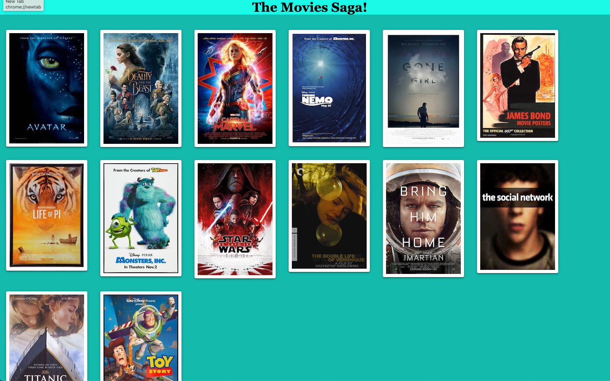
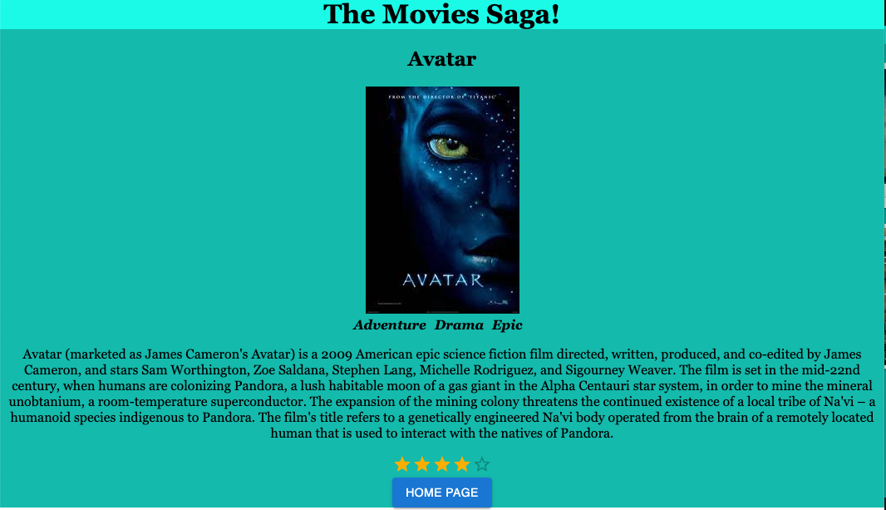

# Project Name
Movie Sagas!

## Description
Movie Sagas us an application that allows users to see the genre and description of each movie by clicking on a movie poster.

## Preview  

## Installation and Setup 
1. Start postgres
2. Create a database named `saga_movies_weekend`
3. Run the queries from `database.sql` on the `saga_movies_weekend` database
4. In terminal run npm install
5. npm run server in your terminal
6. In a new terminal run: npm run client 
7. Navigate to localhost:3000
8. In an new terminal run: npm install @mui/material @emotion/react @emotion/styled

## Technologies utilization
Javascript
HTML
CSS
React
React Router 
Redux
Redux-Saga
Node js
Express js
Axio
Postico 2
PostgreSQL
Postman
GitHub
Material UI

## Acknoledgement
Thanks to Chris Black, Mar McCarthy, and Prime Digital Academy for teaching me the skills required to make this application!

## Support 
If you have suggestions or issues, please email me at jgonzalezkincaid@gmail.com

Thanks for viewing!

[def]: images/description.png